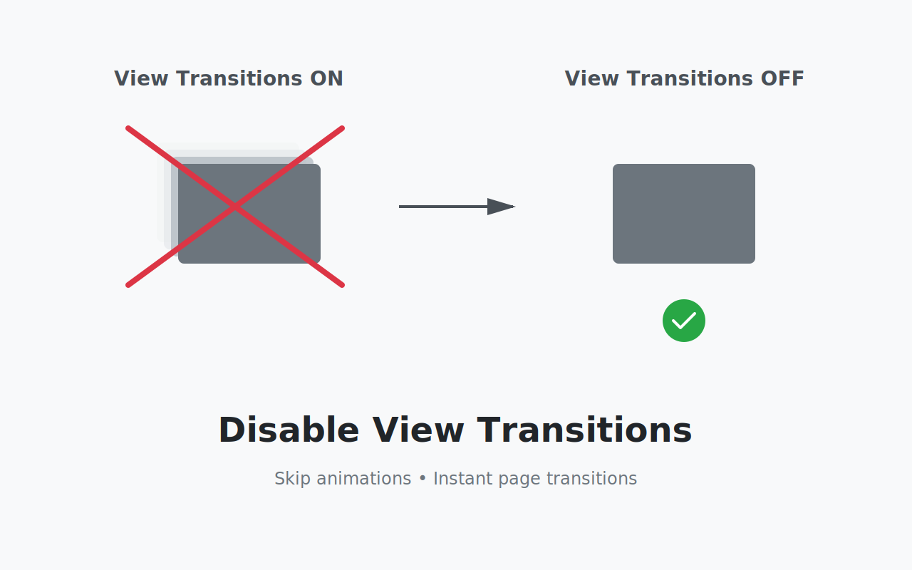

# Disable View Transitions

<center></center>

Turns off animations that use the [View Transition API](https://developer.mozilla.org/docs/Web/API/View_Transition_API).

Monkey-patches [`document.startViewTransition`](https://developer.mozilla.org/docs/Web/API/Document/startViewTransition) to skip the animation completely.

## Note for Advanced Users

If you're familiar with UserScript, you can achieve the same effect by writing:

```
document.startViewTransition = (fn) => typeof fn === "function" && fn()
```
