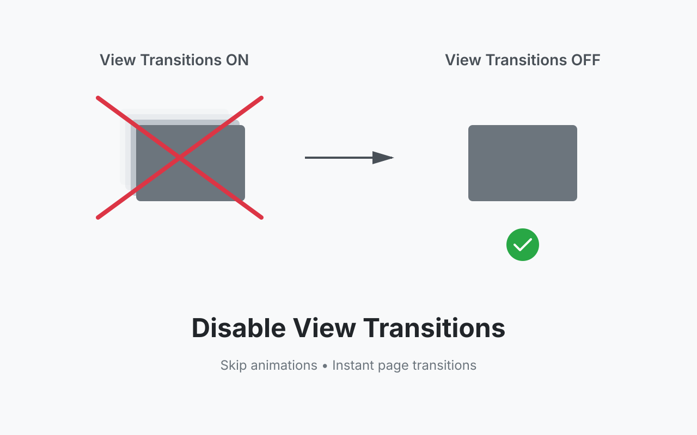

#  Disable View Transitions

<center></center>

<a href="https://chromewebstore.google.com/detail/igommcnaiomapjgfbmhaapnfgffagpak"></a>
<a href="https://chromewebstore.google.com/detail/igommcnaiomapjgfbmhaapnfgffagpak"></a>

Turns off animations that use the [View Transition API](https://developer.mozilla.org/docs/Web/API/View_Transition_API).

Monkey-patches [`document.startViewTransition`](https://developer.mozilla.org/docs/Web/API/Document/startViewTransition) to skip the animation completely.

## Note for Advanced Users

If you're familiar with UserScript, you can achieve the same effect by writing the following code:

```js
document.startViewTransition = (fn) => typeof fn === "function" && fn();
```
