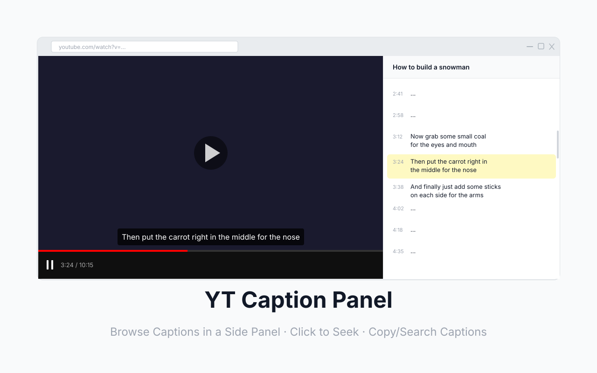

#  YT Caption Panel

View, search, and navigate YouTube captions in a side panel.

## Usage

1. Pin the extension to the toolbar.
2. Click the pinned extension to open side panel.
3. Play a YouTube video with captions enabled.
